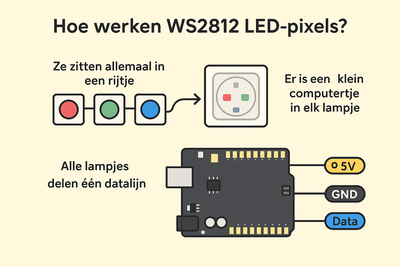
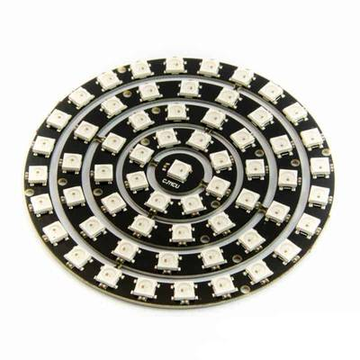
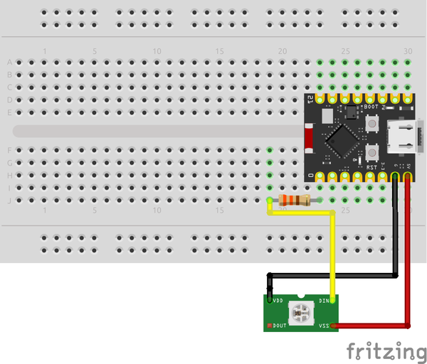

#Pixel ringen
## Inleiding
We gaan met behulp van een WS2812b-pixel ring en een Arduino of ESP32 microcontroller leuke lichteffecten maken terwijl we iets bijleren over kleur en programmeren.

We doen dit in vele stappen. Je hoeft niet alles te doen. Je kan dus zelf dingen uitproberen en jouw eigen ding doen als je dat wil. Te eenvoudige zaken die je al kent mag je overslagen.

Er zijn verschillende Arduino sketches die je stap voor stap de weg wijzen. En je kan natuurlijk altijd vragen stellen aan jouw buur of coach.

Maar eerst, wat zijn WS2812b-pixels?
Je zal ze zeker al eens gezien hebben. Knipperende slingers in een etalage of kerstboom bijvoorbeeld.

### Wat zijn WS2812b LED-pixels en hoe werken ze?

WS2812b-pixels (ook wel **NeoPixels** genoemd) zijn **slimme lichtjes** die vele kleuren kunnen tonen. Elke pixel kan de basiskleuren rood, groen en blauw licht geven. Door deze kleuren te mengen, kan elke pixel alle kleuren van de regenboog laten zien.

### Hoe werken pixels?
1.  Ze zitten allemaal in een rijtje, matrix of cirkel. Denk aan een rij van lichtjes. Er is **één keten** die de signalen doorgeeft van de eerste pixel naar het volgende, enzovoort.

2.  Er zit een klein computertje in elke pixel.  Dat computertje onthoudt welke kleur de pixel moet tonen.  Het ontvangt een bericht (een "data-signaal") en zegt "Ah, ik ben pixel nummer 1, ik moet blauw worden!". Daarna stuurt het de rest van het bericht doornaar de volgende pixel.

3.  **Alle pixels delen één datalijn.**
    De Arduino of ESP32 stuurt een soort kleurbericht, zoals:
    - *Pixel 1: rood*
    - *Pixel 2: geel*
    - *Pixel 3: paars*

    **En elke pixel gebruikt** alleen **dat** deel dat het nodig heeft.

4.  Er zijn drie draden:

    - **5V** -- de spanning voor de pixels
    - **GND** -- de "nul" of "grond"
    - **Data** -- de instructies (welke kleur elke pixel krijgt)

### Wat gebeurt er als je het opstart?
1.  De microcontroller (bijvoorbeeld een **Arduino** of **ESP32**) stuurt snel digitale signalen.
2.  De eerste WS2812b luistert, onthoudt zijn kleur, en geeft de rest van de boodschap door.
3.  Binnen enkele milliseconden hebben alle pixels hun kleur gekregen!
4.  En dan... ze lichten allemaal op in de kleuren die je in de code hebt ingesteld.

### Wat kun je ermee doen?
- Informatie weergeven
- Lichteffecten
- Een spel maken, ...

## Wat heb je nodig?
- Een computer met Arduino IDE software: [Arduino IDE software download](https://docs.arduino.cc/software/ide/).
- Een USB kabeltje dat past op jouw computer en op de microcontroller die je gebruikt.
- Een microcontroller: een Arduino of een ESP32.
- Een WS2812b-pixel ring of led matrix.

## Voorbereiding met hulp van de coach
Vraag jouw coach om te helpen, want als je WS2812b-pixels fout aansluit worden ze onbruikbaar.

1.  Als je een ESP32 gebruikt, installeer dan de **ESP32 board support** in de Arduino IDE.

    - Bestand → Voorkeuren → Extra board URL's:
    - Copy code https://dl.espressif.com/dl/package_esp32_index.json
    - Dan: Hulpmiddelen → Board → ESP32 → **Jouw bord keuze**

2.  Installeer de bibliotheek:
    - Sketch → Bibliotheek gebruiken → Bibliotheken beheren
    - Zoek naar *Adafruit NeoPixel* en installeer.

3.  Controleer de verbinding met de WS2812b-pixels.
    - Data in → GPIO ? Zie sketches en welk type ESP32 of Arduino. Bij voorkeur in serie een 300 tot 500 Ohm weerstand plaatsen
    - 5V → 5V
    - GND → GND

Hier een voorbeeld met een ESP32 C3 SuperMini die met een 330 Ohm weerstand verbonden is aan een WS2812b. De tekening toont slechts één WS2812b-pixel, maar wij gebruiken een ring met meerdere pixels.

## Nu begint het echte werk!
- Open de folder met een hele reeks Arduino sketches met op het einde een nummer. Start met coderdojo_pixels_ring_1.ino, daarna coderdojo_pixels_ring_1.ino, enz.
- Wat je kan doen wordt in elke Arduino sketch beschreven.
- Voor je verder gaat, denk er aan dat het zelf uitproberen en plezier hebben in wat je doet belangrijker is dan alles in een sneltempo af te werken.
- Je mag gerust eens spieken als je niet goed weet hoe het verder moet door naar de volgende Arduino sketch te kijken. Maar probeer het eerst zelf eens. Zo leer je het meeste bij.
- Als je thuis wil verder doen en zo een ring bestellen zoek dan online naar 'WS2812b 5050 RGB LED Ring'. AliExpress is vaak het voordeligste. [Bijvoorbeeld](https://nl.aliexpress.com/item/1005008094797562.html?spm=a2g0o.order_detail.order_detail_item.4.7e0cf19c5uhcdi&gatewayAdapt=glo2nld)

## Versie info
- Versie 1, 13/10/2025, Steve Van Hoyweghen: Eerste versie, te gebruiken in combinatie met de bijbehorende sketches.
